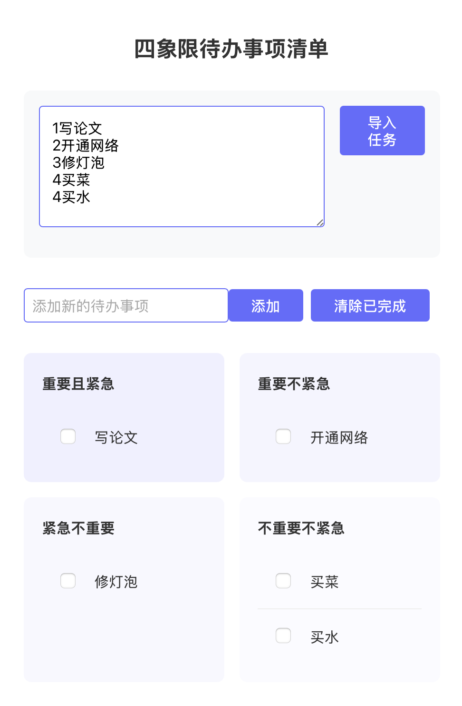

# 四象限待办事项应用

一个基于React + TypeScript + Vite开发的四象限待办事项管理应用，帮助用户根据任务的重要性和紧急程度进行任务管理。

## 应用界面



上图展示了应用的主要界面，包括四个任务象限、快速添加任务的输入框以及备忘录功能区域。通过直观的界面布局，用户可以轻松地管理和分类各项任务。

## 主要功能

- 四象限任务分类：根据任务的重要性和紧急程度将任务分为四类
  - 重要且紧急
  - 重要不紧急
  - 紧急不重要
  - 不重要不紧急
- 快速添加任务：支持通过数字前缀（1-4）快速将任务分类
  - 1：重要且紧急
  - 2：重要不紧急
  - 3：紧急不重要
  - 4：不重要不紧急
- 任务管理功能
  - 拖拽任务在不同象限间移动
  - 双击编辑任务内容
  - 标记任务完成状态
  - 删除单个任务
  - 清空指定象限的所有任务
  - 清除所有已完成的任务
- 备忘录功能
  - 支持多行文本输入
  - 支持批量导入任务
- 数据持久化：自动保存任务和备忘录内容到本地存储

## 使用说明

1. 添加任务：
   - 直接在输入框中输入任务内容
   - 使用数字前缀（1-4）快速分类，如："1 完成项目报告"

2. 管理任务：
   - 拖拽：通过拖拽调整任务所属象限
   - 编辑：双击任务文本进行编辑
   - 完成：点击任务前的复选框标记完成
   - 删除：点击任务右侧的 × 按钮删除任务

3. 使用备忘录：
   - 在备忘录中记录临时内容
   - 使用数字前缀编写多个任务，点击"导入任务"批量添加

## 技术栈

- React 18
- TypeScript
- Vite
- LocalStorage API
- HTML5 Drag and Drop API

## 开发说明

### 安装依赖

```bash
npm install
```

### 开发环境运行

```bash
npm run dev
```

### 构建生产版本

```bash
npm run build
```

### 预览生产版本

```bash
npm run preview
```
